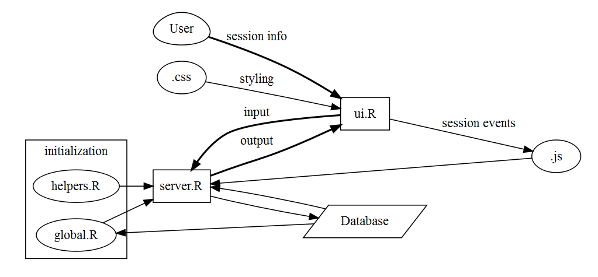
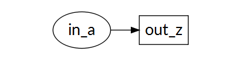
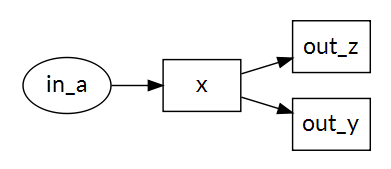
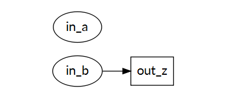
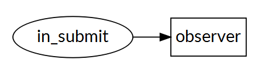

Shiny: R Friday Forum
========================================================
author: Jonathan Hill
date: 2016-02-26
autosize: true
font-family: 'Lato'

Everything's on [GitHub](https://github.com/Dripdrop12/RFridayForum)!

Start here:
========================================================

```r
install.packages("shiny")
require(shiny)
runExample()
```

```
Valid examples are "01_hello", "02_text", "03_reactivity", "04_mpg", "05_sliders", "06_tabsets", "07_widgets", "08_html", "09_upload", "10_download", "11_timer"
```

```r
runExample("01_hello")
```

Files
========================================================
## Basic
- app.R 
- server.R
- ui.R
- global.R

***
## Advanced
- helpers.R
- DESCRIPTION.txt
- Readme.md
- Shiny Modules
- Database (MySQL, PostgreSQL, Redshift)
- images, .css, .js, etc.

Basic flow
========================================================



Execution
========================================================
Runs once during initialization


```r
# -- global.R -- #

library(dplyr)
df <- read.csv("file.csv")
```

Runs throughout the session

```r
# -- server.R -- #

server <-
    function(input, output, session) {
        # regular computations
}
```

server.R
========================================================

```r
server <-
    function(input, output, session) {
        
    output$<id> <- renderPlot({
        
        # user input will trigger this statement #
        
        x <- mtcars[ , input$<id> ]
        plot(x, y)
    })
}
```

Input
========================================================
Must be placed within one of the following functions:

Function | Output
---------|------------
render | a shiny UI component
reactive | a reactive expression
observe | a reactive observer
isolate | a non-reactive copy of a reactive object

Reactivity
========================================================
When an input changes the server will rebuild each output that depends on it (event if that dependence is indirect).  You can control that process with the following functions:

## 1 - Render(expr) Reactive Output

```r
output$z <- renderText({
    input$a
})
```
An output automatically updates whenever an input changes

 

2 - Reactive(expr) to Modularize Reactions
========================================================
Used to create objects that will be used in multiple outputs:


```r
x <- reactive({ input$a })

output$y <- renderText({ x() })

output$z <- renderText({ x() })
```



3 - Isolate(expr) to Prevent Reactions
========================================================
Shiny will only update *z* when *b* changes:


```r
output$z <- renderText({
    paste(
        isolate(input$a),
        input$b
        )
    })
```



4 - Observe(event) to Trigger Code
========================================================
Use observers to contain computationally intensive pieces of your server:


```r
observeEvent(input$submit, {
    
    cashflow <- function(
        loanTerm = input$loan_term,
        defaultRate = input$default_rate,
        ...
    )
})
```



User Interface
========================================================

```r
# -- ui.R -- #

ui <- fluidPage(
    textInput("a", "")
)

ui

## <div class="container-fluid">
## <div class="form-group shiny-input-container">
## <label for="a"></label>
## <input id="a" type="text"
## class="form-control" value=""/>
## </div>
## </div>
```

Layout Options
========================================================

- fluidPage
- fluidRow
- flowLayout
- sidebarLayout
- splitLayout

### HTML:
HTML('complete layout here')


***
- verticalLayout
- tabsetPanel
- navlistPanel
- navbarPage

What will this layout produce?
========================================================


```r
ui <- fluidPage(
    fluidRow(column(width = 4), 
             column(width = 4), 
             column(width = 4)
        ),
    fluidRow(column(width = 12)
        )
) 
```

HTML Tags
========================================================

```r
h1("Header 1")
br()
p(strong("bold"))
code("code")
```
<h1>Header 1</h1> 
<br></br>
<p>
  <strong>bold</strong>
</p> 
<code>code</code>

More Tags
========================================================
Type [tags$] + [TAB] for a complete list.  

There are over 100 available, and if you can't find what you are looking for, you can just pass the HTML as text through:


```r
HTML("<p>Raw html</p>")
```

JavaScript and CSS
========================================================
### Short Scripts:

```r
includeCSS('raw CSS here')

includeScript('raw JavaScript here')
```

### Long Scripts and Images:
Place the file in your www/ subdirectory, then reference it with:


```r
# CSS
tags$head(tags$link(rel = "stylesheet",
 type = "text/css", href = "<file name>"))

# JavaScript
tags$head(tags$script(src = "<file name>"))

# Images
img(src="<file name>")
```

========================================================
## Demo APP

```r
runExample("06_tabsets")
```


========================================================

## Learn More
- [Tutorial](http://shiny.rstudio.com/tutorial/)
- [Shiny Articles](http://shiny.rstudio.com/articles/)
- [Shiny Gallery](http://shiny.rstudio.com/gallery/)
- [Shiny Showcase](https://www.rstudio.com/products/shiny/shiny-user-showcase/)

***
## Building Tools
- [Cheat Sheet](http://shiny.rstudio.com/images/shiny-cheatsheet.pdf)
- [Font Awesome Icons](http://fontawesome.io/icons/)
- [CSS Style Sheets](http://bootswatch.com/)
- [AdminLTE Layout (shinydashboard)](http://rstudio.github.io/shinydashboard/)
- [shinyjs](https://github.com/daattali/shinyjs/blob/master/README.md)

GitHub
========================================================
Everything for this presentation can be found on [my github account](https://github.com/Dripdrop12/RFridayForum).  

You can also check out [Vadim's](https://github.com/vadimus202), too.

